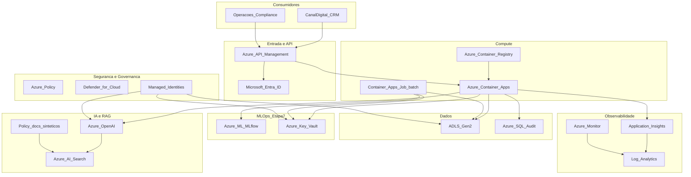
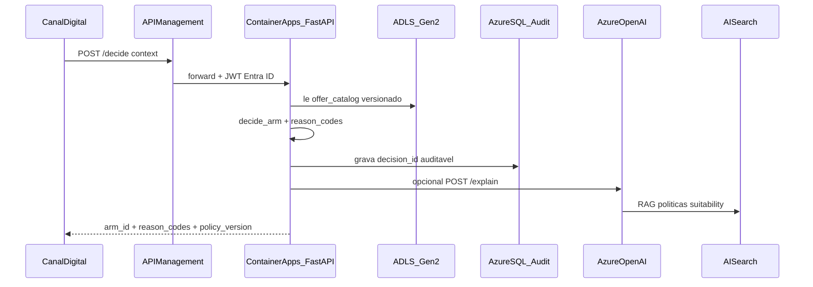
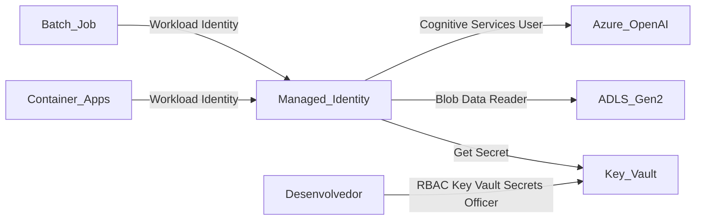

# Arquitetura-alvo Azure — Datathon 7MLET (Grupo 87)

> **Etapa 6** · Como a plataforma de experimentação adaptativa seria operada em **Azure exclusivamente**, com Key Vault, Managed Identity e trade-offs documentados.

## 1. Contexto e escopo

### O que roda localmente hoje

| Camada | Artefato local | Comando |
| --- | --- | --- |
| Dados | `data/processed/`, `data/synthetic_enrichment/`, `data/golden_set/` | `poetry run python -m src.data.prepare` |
| Bandit (offline) | `src/bandits/` | `poetry run python -m src.bandits.experiment` |
| Avaliação | `src/evaluation/` | `poetry run python -m src.evaluation` |
| Serving | FastAPI `src/service/app.py` | `poetry run uvicorn src.service.app:app` |
| Pipeline | `scripts/run_pipeline.py` | Etapas 1 → 2 → 4 (golden set) → 5 |

### O que a arquitetura-alvo operacionaliza

- **Decisão em tempo real** (`POST /decide`) com auditoria (`decision_id`, `reason_codes`, `policy_version`).
- **Dados versionados** em lakehouse (parquet + metadados de proveniência).
- **Assistente RAG** (Azure OpenAI + AI Search) sobre políticas sintéticas em `data/synthetic_enrichment/policy_docs/`.
- **Observabilidade** de latência, fallbacks e drift de recompensa.
- **Governança** com identidade gerenciada, segredos centralizados e approval gate (Etapa 7).

> Esta etapa documenta a **arquitetura-alvo** — deploy real na nuvem não é obrigatório para aceite, mas o plano abaixo é executável.

### Política servida vs bandit offline

| Camada | Política | Papel |
| --- | --- | --- |
| Etapa 3 (simulação) | Thompson Sampling, UCB, baseline fixo | Comparação quantitativa (regret, exploração) |
| Etapa 4/5 (serving) | Gulosa contextual + trilhos de segurança (`context-greedy-v1`) | Decisão auditável em produção |

A arquitetura Azure serve a **política contextual da Etapa 5**; experimentos bandit rodam em **Container Apps Jobs** ou **Azure ML Pipelines** (Etapa 7).

---

## 2. Diagrama de arquitetura



**Ambientes:** `dev` · `staging` · `prod` — Resource Groups separados (`rg-datathon-87-{env}`), mesma topologia, SKUs distintos.

---

## 3. Mapeamento local → Azure

| Camada exigida | Componente local | Serviço Azure | Justificativa |
| --- | --- | --- | --- |
| **Compute** | FastAPI + uvicorn | **Azure Container Apps** | Scale-to-zero, health probes em `/health`, Jobs para batch; Dockerfile no repositório |
| **API** | `POST /decide`, `GET /audit/{id}`, OpenAPI | **Azure API Management** | Rate limit, versionamento, JWT (Entra ID), auditoria de chamadas |
| **Dados** | parquet + JSONL | **ADLS Gen2** + **Azure SQL** | Lake para artefatos; SQL para log auditável estruturado com retenção |
| **IA/RAG** | `policy_docs/` (sintético) | **Azure OpenAI** + **Azure AI Search** | Assistente explica decisões e resume experimentos |
| **Observabilidade** | `logs/decisions.jsonl`, reason codes | **Application Insights** + **Log Analytics** + **Azure Monitor** | Métricas de negócio (`policy_version`, taxa de fallback) |
| **Segurança** | `.env` local (Kaggle) | **Key Vault** + **Private Endpoints** + **NSG** | Zero segredos em plain-text no container |
| **Identidade** | Sem auth hoje | **Managed Identity** + **Entra ID** | MI acessa KV, Storage, OpenAI; consumidores autenticados via JWT |
| **Governança** | golden set, relatórios | **Azure Policy** + **Defender for Cloud** + RBAC | Tags obrigatórias, criptografia, revisão periódica |

### Fluxo de decisão



---

## 4. Decisão de compute: Container Apps vs AKS

| Critério | Container Apps (primário) | AKS (evolução) |
| --- | --- | --- |
| Carga atual | 1 API + jobs batch esporádicos | Mesma carga com overhead desproporcional |
| Complexidade ops | Baixa | Alta (nodes, ingress, upgrades) |
| Custo mínimo dev | ~$15–30/mês | ~$70–150+/mês |
| Adequação ao datathon | Alta | Over-engineering como default |

**Decisão:** Container Apps como arquitetura-alvo **primária**. AKS documentado como **caminho de escala** quando:

- \>100k decisões/dia com canary/rollback de `policy_version`
- Múltiplos microserviços com deploy independente
- Retreino contínuo com GPU (Etapa 7)

**Alternativas descartadas:**

| Alternativa | Motivo |
| --- | --- |
| AWS / GCP | Enunciado exige Azure exclusivamente |
| Azure Functions | Menos adequado para FastAPI stateful + jobs longos |
| App Service | Jobs batch menos integrados que Container Apps Jobs |
| AKS (default) | Overhead operacional e FinOps desproporcional ao PoC |

---

## 5. Camada IA/RAG (sintética)

### Corpus

Documentos em [`data/synthetic_enrichment/policy_docs/`](../data/synthetic_enrichment/policy_docs/):

- `suitability-guidelines.md` — diretrizes gerais
- `channel-eligibility.md` — canais e fallbacks
- `offer-arm-*.md` — política por braço

### Fluxo RAG

1. Operador pergunta: *"Por que `arm_rate_boost` foi bloqueado?"*
2. **Azure AI Search** recupera trechos de `channel-eligibility.md` e `offer-arm-rate-boost.md`.
3. **Azure OpenAI** (`gpt-4o-mini`) gera resposta citando fontes + `reason_codes` do log.
4. Guardrails: sem PII, citações obrigatórias, humano no loop para exceções.

### Endpoint futuro (Etapa 7/8)

```
POST /explain
{ "decision_id": "...", "question": "..." }
→ { "answer": "...", "sources": ["channel-eligibility.md#..."], "policy_version": "..." }
```

---

## 6. Gestão de segredos: Key Vault + Managed Identity



### Segredos no Key Vault

| Segredo | Uso |
| --- | --- |
| `kaggle-key` | Pipeline de ingestão (dev apenas) |
| `openai-endpoint` | Azure OpenAI |
| `openai-api-key` | Fallback até MI com RBAC completo |
| `sql-connection-string` | Audit log (via MI preferencialmente) |

### Princípios

- **Nenhum** segredo em variáveis plain-text no container — usar [Key Vault references](https://learn.microsoft.com/azure/app-service/app-service-key-vault-references) ou SDK com `DefaultAzureCredential`.
- **Managed Identity** (user-assigned) compartilhada entre Container App e Jobs.
- Rotação de segredos sem redeploy (referências dinâmicas).

---

## 7. Plano de deploy

### Fase A — Fundação

1. Resource Group `rg-datathon-87-{env}` em `brazilsouth` (OpenAI em `eastus2` se indisponível — documentar latência).
2. Key Vault com RBAC habilitado.
3. User-Assigned Managed Identity `id-datathon-87-{env}`.
4. Roles: `Key Vault Secrets User`, `Storage Blob Data Reader`, `Cognitive Services OpenAI User`.

### Fase B — Dados

1. Storage Account + container `datalake` (`processed/`, `synthetic/`, `golden_set/`, `policy_docs/`).
2. Upload dos artefatos versionados do repositório.
3. Azure SQL (Basic dev) com tabela `decisions_audit` espelhando o JSONL local.

### Fase C — Serviço de decisão

```bash
# Build local (ver Dockerfile na raiz)
docker build -t datathon-decision-api .
docker run -p 8000:8000 datathon-decision-api

# Deploy Azure
az acr build --registry <acr> --image decision-api:latest .
az containerapp create --name ca-decision-api \
  --resource-group rg-datathon-87-dev \
  --environment cae-datathon-87 \
  --image <acr>.azurecr.io/decision-api:latest \
  --target-port 8000 \
  --ingress external \
  --user-assigned <mi-resource-id> \
  --env-vars POLICY_VERSION=context-greedy-v1
```

4. Health probe: `GET /health` (liveness + readiness).
5. API Management na frente com JWT (Entra ID) e rate limit (ex.: 100 req/min/dev).

### Fase D — IA/RAG

1. Azure AI Search (Basic) + índice `policy-suitability`.
2. Indexar `policy_docs/*.md`.
3. Azure OpenAI deployment `gpt-4o-mini`.

### Fase E — Observabilidade

1. Application Insights vinculado ao Container Apps.
2. Alertas: latência p95 > 500ms, taxa `SAFE_FALLBACK_*` > 15%, erros 5xx.
3. Dashboard com dimensões `policy_version` e `catalog_hash`.

### Fase F — Governança

1. Azure Policy: tags `project`, `env`, `owner` obrigatórias.
2. Defender for Cloud ativo.
3. RBAC: `Contributor` (dev), `Reader` (auditoria), approval gate para prod (Etapa 7).

---

## 8. FinOps — estimativa qualitativa de custo

Valores ordem de grandeza (USD/mês, 2026):

| Serviço | Dev | Staging | Prod (10k req/dia) | Driver |
| --- | --- | --- | --- | --- |
| Container Apps | $15–30 | $30–50 | $80–150 | vCPU-seconds + réplicas |
| API Management (Consumption) | $5 | $10 | $50+ | chamadas |
| ADLS Gen2 | < $5 | < $10 | ~$20 | storage + transações |
| Azure SQL Basic | $5 | $15 | $50+ | DTU + retenção |
| Azure OpenAI | $10 | $20 | $100+ | tokens |
| AI Search Basic | $75 | $75 | $250+ | índice + réplicas |
| App Insights + Log Analytics | $5 | $15 | $50+ | ingestão GB/dia |
| Key Vault | < $1 | < $1 | < $5 | operações |
| **TCO (Container Apps)** | **~$120–150** | **~$180–220** | **~$600–900** | AI Search domina em dev |
| AKS (se adotado) | $200–350 | $300–500 | $900–1500 | nodes 24/7 |

### ROI narrativo

- Baseline fixo: regret **1400** vs Thompson Sampling: **56.6** (Etapa 3).
- Golden set: **100%** pass rate em 24 casos (Etapa 4).
- Redução de tráfego desperdiçado em A/B fixo → maior conversão por braço ótimo.

### Cenários de escala

| Volume | Ajuste principal | Custo relativo |
| --- | --- | --- |
| 1k req/dia | 1 réplica Container Apps, scale-to-zero | Baixo |
| 10k req/dia | 2–3 réplicas, SQL tier superior | Médio |
| 100k req/dia | APIM Premium, AI Search Standard, considerar AKS | Alto |

---

## 9. Ganchos para Etapa 7 (MLOps)

| Gancho local | Serviço Azure |
| --- | --- |
| `policy_version` em [`policy_meta.py`](../src/service/policy_meta.py) | Promoção/rollback via approval gate |
| `src.bandits.experiment` | Azure ML Pipeline + MLflow tracking |
| `src.evaluation` (golden set) | Gate de qualidade antes de promover política |
| `logs/decisions.jsonl` | Monitoramento de drift e recompensa atrasada |
| Container Apps Job | Retreino agendado + deploy canário |

---

## 10. Checklist de aceite — Etapa 6

- [x] `docs/architecture-azure.md` com diagrama Mermaid
- [x] Mapeamento local → Azure por camada
- [x] Camadas: compute, API, dados, IA/RAG, observabilidade, segurança, identidade, governança
- [x] Key Vault + Managed Identity documentados
- [x] Plano de deploy (dev → staging → prod)
- [x] Estimativa qualitativa de custo + TCO por cenário
- [x] Trade-offs (Container Apps vs AKS, alternativas descartadas)
- [x] Cenários de escala
- [x] Ganchos para Etapa 7

---

## Referências

- Código do serviço: [`src/service/`](../src/service/)
- Plano Etapa 5: [`docs/etapa-5-plan.md`](etapa-5-plan.md)
- Políticas RAG: [`data/synthetic_enrichment/policy_docs/`](../data/synthetic_enrichment/policy_docs/)
- [Azure Container Apps](https://learn.microsoft.com/azure/container-apps/)
- [Azure Key Vault + Managed Identity](https://learn.microsoft.com/azure/key-vault/general/authentication)
