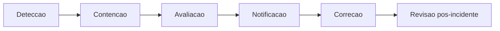

# Plano LGPD — Datathon 7MLET (Grupo 87)

> **Etapa 8** · Tratamento de dados pessoais e conformidade com a Lei Geral de Proteção de Dados.
> Última revisão: 2026-07-23 · Versão do documento: 1.0

## 1. Contexto e declaração

Este projeto é um **demonstrador acadêmico de Machine Learning Engineering** (Datathon FIAP).
Utiliza exclusivamente:

- Base pública **Bank Marketing** (UCI/Kaggle, CC BY 4.0) — **sem identificadores pessoais**.
- Camada **sintética** de experimentação (ofertas, eventos, recompensas) — **sem PII real**.
- Segmentos agregados derivados (faixa etária, histórico de contato, regime macro).

> **Não há dados reais de titulares** no escopo deste projeto. Nenhum identificador pessoal,
> renda, patrimônio, gênero ou raça é coletado ou processado
> ([`data/kaggle/README.md`](../data/kaggle/README.md) §Limitações, item 5).

Caso a solução fosse implantada em produção real com dados de clientes, as seções abaixo
descrevem o **plano de conformidade hipotético** a ser implementado.

## 2. Base legal e finalidade

| Aspecto | Escopo atual (PoC) | Escopo hipotético (produção) |
| --- | --- | --- |
| **Base legal** | Pesquisa acadêmica / demonstração técnica (sem titulares reais) | Legítimo interesse (Art. 7º, IX) ou consentimento (Art. 7º, I) |
| **Finalidade** | Demonstrar maturidade MLE em experimentação adaptativa de ofertas | Personalização responsável de ofertas em canais digitais |
| **Controlador** | Equipe do Datathon (Grupo 87) | Instituição financeira contratante |
| **Operador** | N/A (dados sintéticos) | Provedor de infraestrutura Azure (DPA) |

### Finalidades específicas

1. Treinar e avaliar políticas de decisão adaptativa (multi-armed bandit).
2. Registrar decisões para auditoria e explicabilidade (`decision_id`, `reason_codes`).
3. Monitorar drift e degradação de recompensa (MLOps).
4. Explicar decisões via assistente RAG (políticas sintéticas).

## 3. Minimização de dados

### O que é coletado/processado

| Dado | Tipo | PII? | Justificativa |
| --- | --- | --- | --- |
| `age` (faixa) | Numérico → segmento | Não (agregado) | Contexto de decisão |
| `contact` (canal) | Categórico | Não | Canal de comunicação |
| `poutcome`, `pdays`, `previous` | Histórico de campanha | Não | Contexto de elegibilidade |
| `job`, `month` | Categórico | Não | Segmentação sintética |
| Indicadores macro (`emp_var_rate`, etc.) | Numérico | Não | Contexto econômico |
| `decision_id` | UUID | Não | Rastreabilidade de decisão |
| `policy_version` | String | Não | Versionamento de política |

### O que NÃO é coletado

- Nome, CPF, e-mail, telefone ou qualquer identificador direto/indireto.
- Renda, patrimônio, gênero, raça, orientação sexual, religião.
- Dados biométricos, de saúde ou de menores identificáveis.
- Regras comerciais privadas ou dados de clientes reais.

### Princípios aplicados

- **Minimização (Art. 6º, III):** apenas atributos necessários para a decisão de oferta.
- **Adequação (Art. 6º, II):** dados compatíveis com a finalidade declarada.
- **Transparência (Art. 6º, VI):** reason codes e model/system cards públicos.

## 4. Ciclo de retenção

| Artefato | Local | Retenção (PoC) | Retenção (produção hipotética) |
| --- | --- | --- | --- |
| `logs/decisions.jsonl` | Local (não versionado) | Sessão de desenvolvimento | 90 dias (Azure SQL com TTL) |
| `data/processed/` | Repositório | Indefinida (sem PII, derivado) | Versionado em ADLS Gen2 |
| `data/synthetic_enrichment/` | Repositório | Indefinida (sintético) | Versionado em ADLS Gen2 |
| `data/golden_set/` | Repositório | Indefinida (sintético) | Versionado em ADLS Gen2 |
| `mlruns/` (MLflow) | Local (não versionado) | Sessão de desenvolvimento | Azure ML (retenção configurável) |
| Telemetria (App Insights) | Azure (alvo) | N/A | 90 dias (ingestão) + arquivamento |
| Dados brutos Kaggle | `data/kaggle/raw/` (não versionado) | Descartável após processamento | Não persistir em produção |

### Política de exclusão

- Logs locais: excluídos ao final da sessão de desenvolvimento ou via `.gitignore`.
- Em produção: TTL automático em Azure SQL + política de retenção em Log Analytics.
- Direito de exclusão (Art. 18, VI): procedimento documentado na seção 7 (resposta a incidentes).

## 5. Mapeamento de identificadores e atributos protegidos

| Campo | Identificador pessoal? | Atributo sensível (Art. 5º, II)? | Tratamento |
| --- | --- | --- | --- |
| `decision_id` | Não (UUID técnico) | Não | Log auditável |
| `policy_version` | Não | Não | Metadado de sistema |
| `age` | Não (sem vínculo a titular) | Não (faixa agregada) | Segmento `segment_age_band` |
| `contact` | Não | Não | Canal de comunicação |
| `job` | Não | Não | Categoria profissional agregada |
| Gênero | **Nunca coletado** | N/A | Ausente da base |
| Raça/etnia | **Nunca coletado** | N/A | Ausente da base |
| Renda/patrimônio | **Nunca coletado** | N/A | Ausente da base |

> A base Bank Marketing original **não contém** gênero, raça, renda ou patrimônio. O projeto
> mantém essa restrição e não adiciona atributos sensíveis na camada sintética.

## 6. Política de logs e telemetria

### 6.1 Log auditável local (`logs/decisions.jsonl`)

Cada decisão registra:

```json
{
  "decision_id": "uuid",
  "arm_id": "arm_rate_boost",
  "reason_codes": ["GREEDY_CONTEXT_MATCH"],
  "policy_version": "context-greedy-v1",
  "catalog_hash": "abc123...",
  "context": { "age": 22, "contact": "cellular", ... }
}
```

- **Sem PII:** contexto contém apenas atributos agregados/sintéticos.
- **Acesso:** desenvolvedores do projeto (PoC); em produção, RBAC via Entra ID.
- **Não versionado:** `.gitignore` impede commit acidental.

### 6.2 Telemetria Azure (alvo)

| Dado | Destino | Anonimização |
| --- | --- | --- |
| Latência, status HTTP | Application Insights | Sem dados de contexto do cliente |
| `policy_version`, `catalog_hash` | Custom metrics | Metadados técnicos |
| Taxa de fallback | Custom metrics | Agregado, sem contexto individual |
| Perguntas ao assistente RAG | Log Analytics | Sem PII; revisão periódica |

### 6.3 Quem acessa

| Papel | Acesso (produção hipotética) |
| --- | --- |
| Desenvolvedor MLE | MLflow, logs de experimento (dev) |
| Operador de compliance | Log auditável (read-only, RBAC) |
| Auditor externo | Relatórios agregados, model/system cards |
| Consumidor da API | Apenas resposta da decisão (sem acesso a logs) |

## 7. Plano de resposta a incidentes

### 7.1 Classificação

| Severidade | Exemplo | Prazo de resposta |
| --- | --- | --- |
| **Crítica** | Vazamento de PII em log ou resposta RAG | Imediato (< 1h) |
| **Alta** | Decisão incorreta em massa (drift significativo) | < 4h |
| **Média** | Degradação de métricas (regret, conversão) | < 24h |
| **Baixa** | Falha pontual de API (5xx isolado) | < 48h |

### 7.2 Procedimento



1. **Detecção:** alertas do Azure Monitor (PSI > 0.25, taxa de fallback > 15%, erros 5xx),
   Defender for Cloud, revisão manual de logs.
2. **Contenção:** rollback de `policy_version` via [`src/mlops/registry.py`](../src/mlops/registry.py);
   desabilitar endpoint afetado; isolar logs comprometidos.
3. **Avaliação:** identificar escopo (quantas decisões afetadas, quais segmentos, se há PII).
4. **Notificação:** em caso de vazamento de dados pessoais, notificar ANPD e titulares em até
   72h (Art. 48) — **não aplicável ao PoC** (sem titulares reais).
5. **Correção:** fix do guardrail, reexecução do golden set, nova promoção via approval gate.
6. **Revisão pós-incidente:** atualizar model card, system card e este plano LGPD.

### 7.3 Ferramentas de suporte (Azure)

- **Azure Defender for Cloud:** detecção de ameaças e vulnerabilidades.
- **Azure Policy:** conformidade de tags, criptografia, acesso.
- **Log Analytics:** investigação forense de logs.
- **Key Vault:** rotação de segredos comprometidos.

## 8. Direitos dos titulares (produção hipotética)

| Direito (Art. 18) | Como atender |
| --- | --- |
| Confirmação de tratamento | Portal de transparência com finalidade documentada |
| Acesso aos dados | Exportação do registro auditável por `decision_id` |
| Correção | Atualização de contexto antes da decisão |
| Anonimização/eliminação | Exclusão do registro em `decisions_audit` (TTL) |
| Portabilidade | Exportação em formato estruturado (JSON) |
| Informação sobre compartilhamento | Documentado neste plano e no system card |
| Revogação de consentimento | Desabilitar personalização; fallback para `arm_control` |

> No escopo atual (PoC), não há titulares reais — esta seção documenta o plano para evolução.

## 9. Revisão periódica

| Evento | Responsável | Ação |
| --- | --- | --- |
| Revisão trimestral | Higor | Validar conformidade de retenção e minimização |
| Promoção de política | Narcélio | Verificar se novos campos de contexto respeitam minimização |
| Incidente de segurança | Equipe | Revisão emergencial deste plano |
| Mudança de base de dados | Higor | Revalidar mapeamento de identificadores |

## Referências

- Model card: [`docs/model-card.md`](model-card.md)
- System card: [`docs/system-card.md`](system-card.md)
- Arquitetura Azure (segurança): [`docs/architecture-azure.md`](architecture-azure.md) §6
- Base Kaggle (limitações): [`data/kaggle/README.md`](../data/kaggle/README.md)
- LGPD: [Lei nº 13.709/2018](http://www.planalto.gov.br/ccivil_03/_ato2015-2018/2018/lei/l13709.htm)
