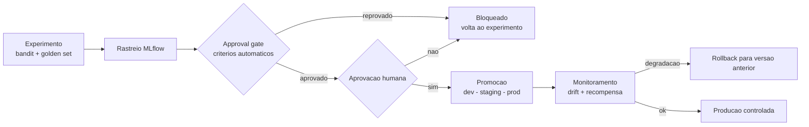

# Ciclo de vida MLOps — Etapa 7

> **Objetivo:** mostrar como uma nova hipótese de oferta/canal/mensagem sai de
> **experimento** para **produção controlada**, com rastreio de experimentos, **approval
> gate**, **aprovação humana**, versionamento de política e **rollback** documentado.

**Evidência de aceite:** o grupo demonstra o caminho experimento → produção com aprovação
humana e rollback. Executável por `poetry run python -m src.mlops --candidate <v> --approve`.

## 1. Visão geral do ciclo



## 2. Componentes (`src/mlops/`)

| Módulo | Papel |
| --- | --- |
| `tracking.py` | Registra params/métricas/tags de cada candidata em **MLflow** (`mlruns/`). |
| `promotion.py` | **Approval gate**: critérios automáticos de qualidade/risco. |
| `registry.py` | Registro de políticas com estágios (dev/staging/prod), histórico e **rollback**. |
| `monitoring.py` | **Drift** de decisão (PSI) e **monitoramento de recompensa** ao longo do tempo. |
| `__main__.py` | CLI que orquestra o fluxo completo. |

## 3. Rastreio de experimentos (MLflow)

Cada avaliação de política candidata vira um **run** no MLflow, com:

- **Params:** `horizon`, `seeds`, `policy_type`.
- **Métricas:** `golden_pass_rate`, `fallback_rate`, `regret`, `optimal_arm_rate`, `conversion_rate`.
- **Tags:** `policy_version`, `stage`, `gate`.

Backend local por padrão (`mlruns/`, não versionado). O `tracking_uri` é configurável —
na arquitetura Azure (Etapa 6) aponta para **Azure ML / MLflow gerenciado**.

## 4. Approval gate (critérios automáticos)

Uma candidata só passa no gate se **todos** os critérios forem atendidos:

| Critério | Limiar padrão | Racional |
| --- | --- | --- |
| `golden_pass_rate` | ≥ 1.0 | 100% do golden set (Etapa 4) — sem regressão de segurança |
| `regret` | ≤ 300 | desempenho adaptativo aceitável vs. ótimo |
| `optimal_arm_rate` | ≥ 0.60 | concentra seleção no melhor braço |
| `fallback_rate` | ≤ 0.30 | evita política que só cai em fallback |

> **Promoção = gate automático APROVADO `E` aprovação humana.** Sem os dois, é bloqueada
> (`promotion_allowed(human_approved)` em `promotion.py`). Isso mantém **humano no loop**
> para decisões sensíveis (domínio financeiro regulado).

## 5. Registro, estágios e rollback

- Estágios: **dev → staging → prod** (transições sequenciais validadas) + `archived`.
- Cada política guarda métricas, `created_at` e **histórico** de transições (quem, quando, nota).
- Ponteiro `active` por estágio → qual política está em cada ambiente.
- **Rollback:** `registry.rollback("prod", …)` restaura a política ativa **anterior** em prod
  e arquiva a atual — reversão controlada e auditável.

Registro versionado inicial: [`mlops/policy_registry.json`](../mlops/policy_registry.json)
(`context-greedy-v1` em prod — a política servida na Etapa 5).

## 6. Monitoramento de drift e de recompensa

- **Drift de decisão:** compara a distribuição de braços do **log auditável** do serving
  (`logs/decisions.jsonl`) com uma referência, via **PSI** (Population Stability Index):
  `< 0.1` estável · `0.1–0.25` moderado · `> 0.25` significativo.
- **Monitoramento de recompensa:** `reward_trend()` acompanha a taxa de recompensa por
  janela temporal (a partir de `delayed_rewards`, Etapa 2), sinalizando degradação.
- **Alertas alvo (Azure/App Insights, Etapa 6):** taxa `SAFE_FALLBACK_*` > 15%, PSI > 0.25,
  queda sustentada de `reward_rate`.

## 7. Plano de retreino / nova hipótese

1. **Hipótese:** novo braço/mensagem/canal ou novos pesos de contexto → nova
   `policy_version` (ex.: `context-greedy-v2`).
2. **Experimento:** roda bandit (`src.bandits.experiment`) + avaliação offline
   (`src.evaluation`) → métricas.
3. **Tracking:** run no MLflow para comparação com a política em produção.
4. **Gate + aprovação humana:** critérios automáticos + revisão manual.
5. **Promoção controlada:** dev → staging (canário) → prod; `policy_version` carimbada em
   toda decisão servida (Etapa 5) permite atribuição e rollback.
6. **Monitoramento:** drift + recompensa; **rollback** automático/manual se degradar.

**Gatilhos de retreino:** drift significativo (PSI > 0.25), queda de conversão observada,
mudança de regime macro, ou cadência periódica (ex.: mensal).

## 8. Como executar

```bash
# Ciclo completo (experimento -> MLflow -> gate -> aprovacao -> promocao -> rollback)
poetry run python -m src.mlops --candidate context-greedy-v2-rc --approve --demo-rollback

# Sem aprovacao humana -> gate bloqueia a promocao
poetry run python -m src.mlops --candidate context-greedy-v2-rc

# Persistir o registro no arquivo versionado
poetry run python -m src.mlops --candidate context-greedy-v2-rc --approve --persist

# Inspecionar experimentos no MLflow
poetry run mlflow ui   # http://127.0.0.1:5000
```

## 9. Ganchos para Azure (Etapa 6) e Governança (Etapa 8)

| Local (Etapa 7) | Azure (Etapa 6) |
| --- | --- |
| MLflow local (`mlruns/`) | **Azure ML** + MLflow gerenciado |
| `PolicyRegistry` (JSON) | **Azure ML Model Registry** / tabela de metadados |
| Approval gate + aprovação humana | **Approval gate** em pipeline (Azure DevOps / GitHub Actions) |
| `monitoring.py` (PSI, reward) | **Application Insights** + **Azure Monitor** (alertas) |
| Rollback no registro | Rollback de revisão no **Container Apps** (canary/traffic split) |

O **model card** e o **system card** (Etapa 8) documentarão versão, limitações e cenários
de risco desta política.

## 10. Checklist de aceite — Etapa 7

- [x] Plano de retreino com critérios de promoção, approval gate, rollback e versionamento
- [x] Monitoramento de **drift** e de **recompensa** documentado e implementado
- [x] Rastreio de experimentos em **MLflow**
- [x] Procedimento de teste + **aprovação humana** estruturada + promoção controlada
- [x] Demonstração executável (`python -m src.mlops`) + testes (`tests/test_mlops.py`)
