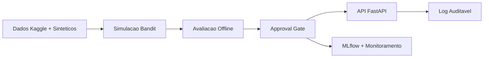

# Plataforma de Experimentação Adaptativa

## Datathon 7MLET — Grupo 87

**Higor Menezes** · **Narcélio Sousa**

Julho 2026

---

## O Problema

- Instituições financeiras precisam decidir **qual oferta** apresentar a cada cliente
- Regras fixas e A/B longos **desperdiçam tráfego** e demoram a reagir
- Necessidade de **personalização responsável** com governança

> Como equilibrar exploração e explotação sem congelar a decisão?

---

## Nossa Abordagem

**Multi-armed bandit** sobre base pública de marketing bancário:

1. Base Kaggle (Bank Marketing) → sem vazamento
2. Camada sintética (ofertas, contexto, recompensas atrasadas)
3. Comparação: baseline fixo vs. Thompson Sampling vs. UCB1
4. Política contextual servida com guardrails auditáveis
5. Ciclo MLOps com approval gate e rollback

---

## Arquitetura da Solução



Pipeline ponta a ponta: `poetry run python scripts/run_pipeline.py`

---

## Demo — Decisão em Tempo Real

```bash
curl -X POST http://127.0.0.1:8000/decide \
  -d '{"age": 22, "contact": "cellular", "poutcome": "success"}'
```

**Resposta:**
```json
{
  "arm_id": "arm_rate_boost",
  "reason_codes": ["GREEDY_CONTEXT_MATCH"],
  "policy_version": "context-greedy-v1",
  "decision_id": "..."
}
```

Cada decisão é **auditável** com reason codes e versão da política.

---

## Demo — Guardrails de Segurança

| Cenário | Resultado |
| --- | --- |
| Canal inválido (`email`) | → `arm_control` (SAFE_FALLBACK) |
| Jovem + stress + cold-start | → `arm_control` (HIGH_RISK) |
| Incentivo bloqueado | → `arm_retention_plus` (REDIRECT) |

6 casos adversariais no golden set: **100% pass rate**

---

## Evidências — Comparação Bandit

| Política | Conversão | Regret | % Braço Ótimo |
| --- | --- | --- | --- |
| Baseline fixo | 4.03% | 1400.0 | 0.0% |
| UCB1 (Nilos-UCB) | 15.14% | 293.9 | 55.0% |
| **Thompson Sampling** | **17.38%** | **56.6** | **90.2%** |

Thompson Sampling reduz regret em **96%** vs. baseline fixo.

---

## Evidências — Golden Set e Fairness

- **24 casos** versionados (typical, edge, segment, adversarial)
- **100% pass rate** em todos os cenários
- Fairness de exposição: max/min ratio ≤ 1.26 por faixa etária
- Análise de sensibilidade a delayed rewards e priors

---

## Arquitetura Azure

| Camada | Serviço Azure |
| --- | --- |
| Compute | Container Apps |
| API | API Management + Entra ID |
| Dados | ADLS Gen2 + Azure SQL |
| IA/RAG | Azure OpenAI + AI Search |
| Segurança | Key Vault + Managed Identity |
| Observabilidade | App Insights + Log Analytics |

**Decisão:** Container Apps (não AKS) — adequado ao PoC, scale-to-zero.

---

## FinOps — Custo e ROI

| Ambiente | TCO estimado (USD/mês) |
| --- | --- |
| Dev | ~$120–150 |
| Prod (10k req/dia) | ~$600–900 |

**ROI:** regret 1400 → 56.6; golden set 100%; redução de tráfego desperdiçado em A/B fixo.

**Escala:** 1k req/dia (1 réplica) → 100k req/dia (APIM Premium + AKS).

---

## Riscos e Governança

| Risco | Mitigação |
| --- | --- |
| Reward hacking | Approval gate + PSI/recompensa |
| Manipulação de contexto | Pydantic + SAFE_FALLBACK_* |
| Abuso do assistente RAG | Corpus sintético, humano no loop |
| Violação de suitability | INCENTIVE_BLOCKED + golden set |

Documentação: Model Card · System Card · Plano LGPD

---

## Impacto e Próximos Passos

**Entregue:** pipeline reprodutível, API auditável, ciclo MLOps, governança completa.

**Futuro:**
- LinUCB contextual
- Deploy Azure real
- Assistente RAG (`/explain`)
- Retreino contínuo com canary deploy

> Não alegamos prontidão para produção real regulada — demonstramos maturidade MLE.

---

## Obrigado!

**Repositório:** `datathon-7mlet-grupo-87`

Perguntas?
