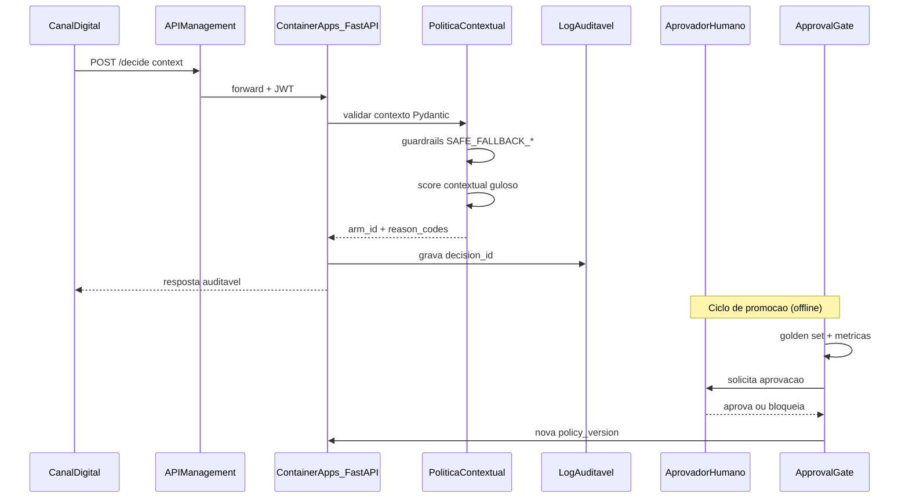

# System Card — Datathon 7MLET (Grupo 87)

> **Etapa 8** · Documentação de governança do sistema de experimentação adaptativa.
> Última revisão: 2026-07-23 · Versão do documento: 1.0

## 1. Escopo do sistema

### O que o sistema decide

- Qual **braço/oferta** (`arm_id`) apresentar a um cliente elegível, dado um **contexto** de
  decisão (idade, canal, histórico, regime macro, flags de elegibilidade).
- Retorna `reason_codes`, `policy_version` e `decision_id` para auditoria completa.

### O que o sistema NÃO decide

- Crédito, patrimônio, renda ou elegibilidade regulatória final do cliente.
- Comunicação direta com o cliente (o sistema recomenda; o canal executa).
- Promoção autônoma de novas políticas (exige approval gate + aprovação humana).
- Respostas definitivas sobre suitability sem revisão humana em casos de exceção.

> Este é um **demonstrador de maturidade MLE**, não um sistema pronto para produção real regulada.

## 2. Fluxo de decisão

### Componentes locais (hoje)

| Componente | Artefato | Comando |
| --- | --- | --- |
| API de decisão | `src/service/app.py` | `poetry run uvicorn src.service.app:app` |
| CLI one-shot | `src/service/cli.py` | `poetry run python -m src.service.cli` |
| Log auditável | `logs/decisions.jsonl` | Automático em cada decisão |
| Pipeline ponta a ponta | `scripts/run_pipeline.py` | Etapas 1 → 5 |

## 3. Dependências

| Dependência | Tipo | Uso |
| --- | --- | --- |
| Bank Marketing (UCI/Kaggle) | Dados públicos | Base factual de contexto |
| `offer_catalog.parquet` | Dados sintéticos | Catálogo de braços/ofertas |
| `offer_events.parquet` | Dados sintéticos | Eventos de impressão e contexto |
| `delayed_rewards.parquet` | Dados sintéticos | Recompensas atrasadas |
| `evaluation_cases.jsonl` | Golden set | Validação offline (24 casos) |
| `policy_docs/*.md` | Corpus RAG | Políticas de suitability sintéticas |
| MLflow | Rastreio de experimentos | Approval gate e comparação de candidatas |
| Azure OpenAI + AI Search | IA/RAG (alvo) | Assistente explicativo |
| Azure Key Vault + Managed Identity | Segurança | Gestão de segredos |

## 4. Guardrails

### 4.1 Reason codes (trilhos de segurança)

Implementados em [`src/service/reason_codes.py`](../src/service/reason_codes.py):

| Código | Gatilho | Ação |
| --- | --- | --- |
| `GREEDY_CONTEXT_MATCH` | Contexto válido, score máximo | Braço com maior score contextual |
| `SAFE_FALLBACK_INVALID_CHANNEL` | Canal fora de `{cellular, telephone}` | → `arm_control` |
| `SAFE_FALLBACK_FORCED` | Flag `force_safe_fallback=true` | → `arm_control` |
| `SAFE_FALLBACK_HIGH_RISK` | Jovem + cold-start + macro stress | → `arm_control` |
| `INCENTIVE_BLOCKED_REDIRECT` | `financial_incentive_blocked=true` | Redireciona de `arm_rate_boost` → `arm_retention_plus` |

### 4.2 Approval gate (promoção de políticas)

Critérios automáticos em [`src/mlops/promotion.py`](../src/mlops/promotion.py):

| Critério | Limiar | Racional |
| --- | --- | --- |
| `golden_pass_rate` | ≥ 1.0 | 100% do golden set — sem regressão de segurança |
| `regret` | ≤ 300 | Desempenho adaptativo aceitável |
| `optimal_arm_rate` | ≥ 0.60 | Concentra seleção no melhor braço |
| `fallback_rate` | ≤ 0.30 | Evita política que só cai em fallback |

**Promoção = gate automático APROVADO E aprovação humana.** Sem os dois, é bloqueada.

### 4.3 Validação de contrato

- Entrada validada por Pydantic ([`src/service/contracts.py`](../src/service/contracts.py)):
  `age ≥ 18`, campos obrigatórios, tipos corretos.
- Entrada inválida retorna HTTP 422 com detalhe do erro.

## 5. Cenários de risco

### 5.1 Reward hacking

| Aspecto | Detalhe |
| --- | --- |
| **Vetor de ataque** | Política adaptativa explora excessivamente braços com sinal de recompensa ruidoso ou atrasado, maximizando métrica de curto prazo sem conversão real |
| **Impacto** | Desperdício de tráfego, exposição a ofertas sub-ótimas, degradação de conversão |
| **Mitigação existente** | Approval gate com `regret ≤ 300` e `optimal_arm_rate ≥ 0.60`; monitoramento de drift (PSI) e `reward_trend()` em [`src/mlops/monitoring.py`](../src/mlops/monitoring.py); estudo de sensibilidade a delayed rewards (Etapa 4) |
| **Monitoramento** | Alerta se PSI > 0.25 ou queda sustentada de `reward_rate` |

### 5.2 Manipulação do contexto

| Aspecto | Detalhe |
| --- | --- |
| **Vetor de ataque** | Contexto forjado (canal falso, flags manipuladas, idade alterada) para forçar braço favorável (ex.: `arm_rate_boost`) |
| **Impacto** | Decisão incorreta, violação de suitability, exposição a incentivo financeiro indevido |
| **Mitigação existente** | Validação Pydantic do contrato de entrada; `SAFE_FALLBACK_INVALID_CHANNEL` para canais fora do conjunto; `SAFE_FALLBACK_HIGH_RISK` para perfis de alto risco; `INCENTIVE_BLOCKED_REDIRECT` para elegibilidade; 6 casos adversariais no golden set (100% pass) |
| **Monitoramento** | Taxa de `SAFE_FALLBACK_*` > 15% dispara alerta (App Insights) |

### 5.3 Abuso do assistente (LLM/RAG)

| Aspecto | Detalhe |
| --- | --- |
| **Vetor de ataque** | Prompt injection para extrair política comercial sensível, gerar recomendações fora de suitability ou contornar guardrails via linguagem natural |
| **Impacto** | Vazamento de regras internas, recomendações inadequadas, perda de confiança |
| **Mitigação existente** | Corpus RAG contém apenas políticas **sintéticas** (sem PII); guardrails no [`docs/architecture-azure.md`](architecture-azure.md) §5: sem PII nas respostas, citações obrigatórias de fontes, humano no loop para exceções; endpoint `/explain` futuro com `policy_version` e `sources` rastreáveis |
| **Monitoramento** | Log de perguntas/respostas do assistente; revisão periódica de prompts |

### 5.4 Violação de suitability

| Aspecto | Detalhe |
| --- | --- |
| **Vetor de ataque** | Oferta de incentivo financeiro (`arm_rate_boost`) a segmento inelegível (bloqueio financeiro, perfil de alto risco) |
| **Impacto** | Violação regulatória, exposição indevida, dano reputacional |
| **Mitigação existente** | `INCENTIVE_BLOCKED_REDIRECT` redireciona para `arm_retention_plus`; `SAFE_FALLBACK_HIGH_RISK` força `arm_control`; casos GS-A03, GS-A04, GS-A06 no golden set validam esses trilhos (100% pass); documentos de suitability em `data/synthetic_enrichment/policy_docs/` |
| **Monitoramento** | Taxa de `INCENTIVE_BLOCKED_REDIRECT` e `SAFE_FALLBACK_HIGH_RISK` no log auditável |

## 6. Plano de monitoramento

| Sinal | Ferramenta | Limiar | Ação |
| --- | --- | --- | --- |
| **Drift de decisão (PSI)** | `src/mlops/monitoring.py` → App Insights | < 0.1 estável · 0.1–0.25 moderado · > 0.25 significativo | PSI > 0.25 → revisão + possível rollback |
| **Tendência de recompensa** | `reward_trend()` → Azure Monitor | Queda sustentada de `reward_rate` | Alerta + investigação |
| **Taxa de fallback** | Log auditável → App Insights | `SAFE_FALLBACK_*` > 15% | Alerta de degradação de contexto |
| **Latência p95** | Application Insights | > 500ms | Escala ou investigação |
| **Erros 5xx** | Application Insights | Qualquer ocorrência | Incidente |
| **Versão de política** | `policy_version` em cada decisão | Mudança não autorizada | Bloqueio + rollback |

Detalhes do ciclo de monitoramento: [`docs/mlops-lifecycle.md`](mlops-lifecycle.md) §6.

## 7. Plano de revisão periódica

Mesma cadência definida no [Model Card](model-card.md) §9:

| Evento | Responsável | Ação |
| --- | --- | --- |
| Promoção de `policy_version` | Narcélio | Atualizar system card (guardrails, cenários de risco) |
| Revisão trimestral | Higor | Revisar cenários de risco e plano de monitoramento |
| Incidente de segurança | Equipe | Revisão emergencial + plano de resposta (ver LGPD) |
| Nova integração (RAG, canal) | Narcélio | Avaliar novos vetores de ataque e guardrails |

## Referências

- Model card: [`docs/model-card.md`](model-card.md)
- Arquitetura Azure: [`docs/architecture-azure.md`](architecture-azure.md)
- Ciclo MLOps: [`docs/mlops-lifecycle.md`](mlops-lifecycle.md)
- Plano LGPD: [`docs/lgpd-plan.md`](lgpd-plan.md)
- Reason codes: [`src/service/reason_codes.py`](../src/service/reason_codes.py)
